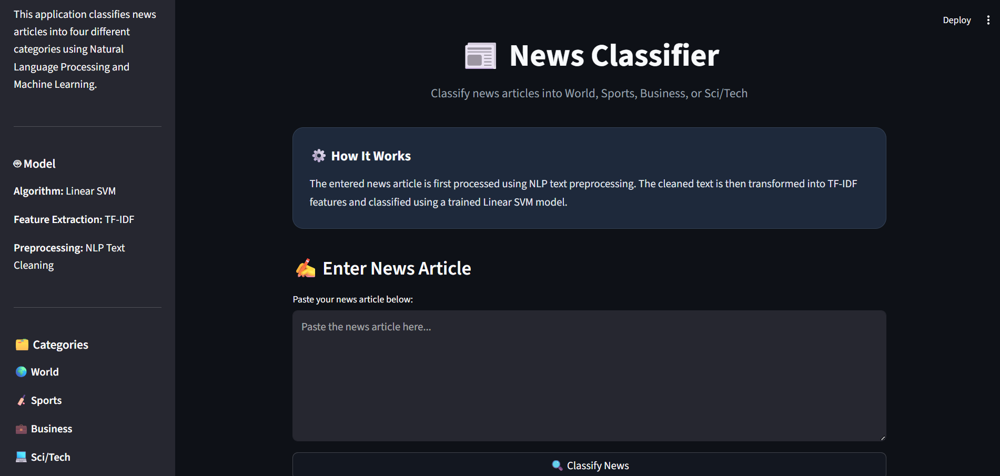
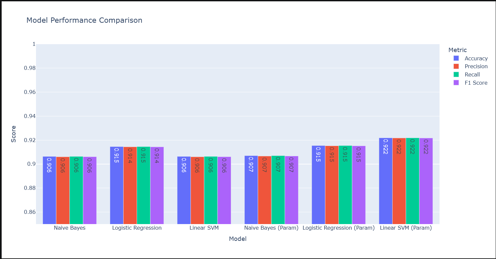

# 📰 News Classifier

An end-to-end NLP-based news classification system that classifies news articles into four categories:

- 🌍 World
- 🏏 Sports
- 💼 Business
- 💻 Sci/Tech

## 🚀 Project Overview

This project uses Natural Language Processing (NLP) and Machine Learning to automatically classify news articles based on their textual content.

The complete pipeline includes:

**Text Preprocessing → TF-IDF Feature Extraction → Model Training → Model Comparison → Final SVM Model → Streamlit Deployment**

## 🛠️ Technologies Used

- Python
- Pandas
- NumPy
- Scikit-learn
- Plotly
- Joblib
- Streamlit

## 🧠 NLP Pipeline

### 1. Text Preprocessing

The raw news articles were cleaned using custom preprocessing steps including:

- HTML entity handling
- Removal of unwanted metadata
- Lowercasing
- URL handling
- Punctuation removal
- Whitespace normalization

### 2. Feature Extraction

TF-IDF (Term Frequency–Inverse Document Frequency) was used to convert the cleaned text into numerical features.

Two TF-IDF configurations were evaluated:

- Standard TF-IDF
- Parameterized TF-IDF

### 3. Machine Learning Models

The following classification algorithms were evaluated:

- Naive Bayes
- Logistic Regression
- Support Vector Machine (SVM)

Both standard and parameterized TF-IDF features were evaluated with the models.

## 📊 Model Evaluation

The models were evaluated using:

- Accuracy
- Precision
- Recall
- F1 Score

Both standard and parameterized TF-IDF configurations were evaluated with Naive Bayes, Logistic Regression, and Linear SVM.

### Model Performance

| Model | TF-IDF Configuration | Accuracy | Precision | Recall | F1 Score |
|---|---|---:|---:|---:|---:|
| Naive Bayes | Standard | 90.64% | 90.61% | 90.64% | 90.61% |
| Logistic Regression | Standard | 91.46% | 91.44% | 91.46% | 91.44% |
| Linear SVM | Standard | 90.64% | 90.61% | 90.64% | 90.61% |
| Naive Bayes | Parameterized | 90.71% | 90.67% | 90.71% | 90.67% |
| Logistic Regression | Parameterized | 91.54% | 91.53% | 91.54% | 91.52% |
| **Linear SVM** | **Parameterized** | **92.19%** | **92.18%** | **92.19%** | **92.17%** |

### 🏆 Final Model

The **Parameterized TF-IDF + Linear SVM** configuration achieved the best overall performance among the evaluated models.

| Metric | Score |
|---|---:|
| Accuracy | **92.19%** |
| Precision | **92.18%** |
| Recall | **92.19%** |
| F1 Score | **92.17%** |

This configuration was selected as the final model and integrated into the Streamlit application for real-time news classification.

## 🌐 Streamlit Application

The project includes an interactive Streamlit web application where users can paste a news article and receive its predicted category.

## 🌐 Live Demo

🚀 **[Try the News Classifier](https://newsclassifier-subhu0110.streamlit.app/)**


## 🖥️ Application Preview

### Home Page



### Prediction


### Model Comparison



### Prediction Flow

```text
News Article
     ↓
Text Preprocessing
     ↓
TF-IDF Vectorization
     ↓
Linear SVM
     ↓
Predicted Category

```

## 📁 Project Structure

```text
NewsClassifier/
│
├── app.py
├── preprocessing.py
├── label_mapping.pkl
├── svm_model.pkl
├── tf_idf_vectorizer.pkl
├── NewsClassifier.ipynb
├── requirements.txt
├── README.md
├── .gitignore
└── screenshots/
    ├── home.png
    ├── prediction.png
    └── model_comparison.png
```

## 👨‍💻 Author

**Subhansh Yadav**

CSE (AI & ML) — IIIT Nagpur

[GitHub](https://github.com/Subhu0110)

